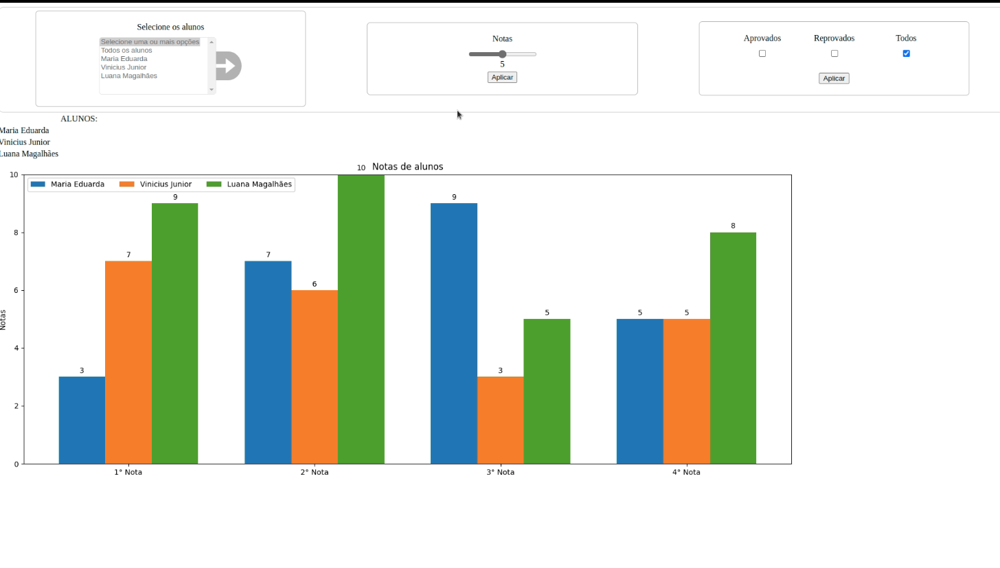

## Django project to render graph plots

 
This project is a simple record of student grades that return if they were approved in their exams.
  
The purpose is to make some fake datas to render plots, filtering by students, grades, approval, and so on.
  
We're trying to use besides Django, pandas and matplotlib
  
Rendered matplotlib graphic in Django, following this tutorial 

[Rendering MathplotLib in Django](https://spapas.github.io/2021/02/08/django-matplotlib)

#### Exemplo do grafico renderizado na aplicação Django

